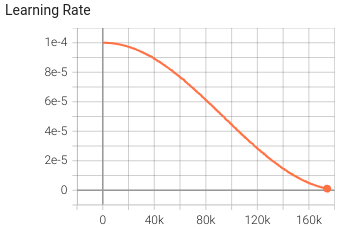

# GPT-2 Training Report

## Training Details

- **Vocabulary Size**: 52,000
- **Position Encoding Length**: 512
- **Optimizer**: AdamW
- **Learning Rate Schedule**: 1e-4, `CosineAnnealingLR(optimizer, T_max=93192)`
- **Batch Size**: 16 GPU *8 batch_size * 2 gradient accumulation = 256
- **Epoch**: 1, contains roughly 180k steps, but stop since the loss seemed saturated already

## Observations and Analysis

### Batch Training Loss

The batch training loss graph shows the loss for individual batches over the training period. Initially, the loss decreased significantly, indicating that the model was learning effectively. However, the high volatility suggests that the learning rate may have been too high or the batch size too small, leading to instability in the model's learning process.

### Learning Rate

A `CosineAnnealingLR` scheduler is used, which adjusts the learning rate following a cosine curve with a maximum of 186387 steps.

### Text generation
#### Original Prompt (Dutch)

`Kerstmis komt dichterbij en mijn lieve vrienden in Eindhoven`

`Translation: Christmas is approaching and my dear friends in Eindhoven`
#### Generated Text (Dutch)

`er een kerst van. is een kerst voor. is kerst. kerst...........................................................................`

#### Analysis

The text generation after the provided prompt results in a string that is repetitive and lacks coherence. The model has produced a sequence of phrases that are variations on the theme of "Christmas" (Dutch: "kerst"), but it fails to construct a meaningful continuation. This kind of output suggests a possible issue with the model's training or a lack of context to properly guide the generation process.

#### English Translation of Generated Text

The direct translation of the generated text is fragmented and does not form complete sentences. Here is a rough translation:
- "there a Christmas of."
- "is a Christmas for."
- "is Christmas. Christmas..........................................................................."

## Conclusions

The model has shown a consistent improvement in performance over time, as evidenced by the reduction in epoch training loss. However, the high volatility in batch loss suggests there may be room for improvement in the hyperparameter settings, particularly the learning rate and batch size. Future training runs could benefit from a more conservative learning rate or larger batch size, along with techniques such as gradient clipping to manage volatility.

